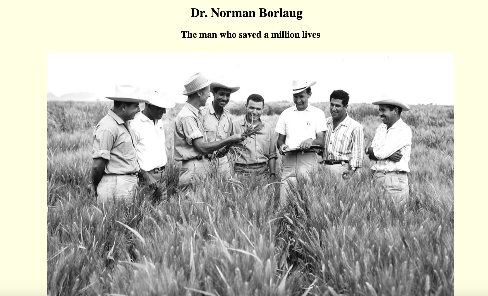

<h1>freeCodeCamp Timeline Project</h1>

To complete freeCodeCamps 300 hour HTML5 & CSS3 certification, making a front-end timeline is part of the requirment. 

<h3>Languages used: </h3> HTML5, and CSS3

